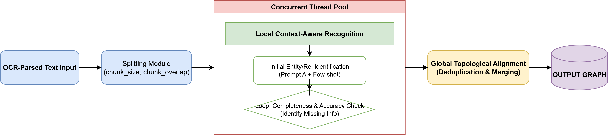

# Sentra: Chat Assistant from Document to Knowledge Base
<div align="center">
  


[](https://github.com/2Elian/cra/issues)

[](./README_CN.md) 
[](./README.md)

**Sentra is a document system based on graph structure, which supports converting documents into graph structures and utilizing local knowledge bases for question answering.**
</div>

<p align="center">
  
</p>

---

## Features

Sentra aims to utilize graph structures to answer questions about the content of documents. All inquiries will be responded to based on the document graph and a relevant knowledge base.

* **User management**: Supports isolation of knowledge bases and Q&A systems in multi-tenant scenarios, with permission control based on sa-token;
* **Knowledge base management**: Supports private and general knowledge bases. Supports parsing and management of knowledge bases in PDF format;
* **Document-based Chat Service**: Graph the document, and all user questions will be answered based on this graph and the private domain + general database
* **Native development**: pip install sentra sentra-core, Sentra is a completely natively developed document-to-knowledge base question-and-answer assistant.

## Architecture

* **Front-end**: Next.js (React) + Tailwind CSS
* **Backend (Business Layer)**: Java Spring Boot microservices (`sentra-user-service`, `sentra-knowledge-service`, `sentra-agent-service`), handling user management, knowledge base, and Agent services.
* **AI Engine**: Python (FastAPI), Agent orchestration is based on LangChain and LangGraph, and knowledge base retrieval is based on GraphRAG/LightRAG/ROGRAG.
* **Data storage**:
    * PostgreSQL (business data)
    * MongoDB (document data)
    * Elasticsearch (basic search engine)
    * Redis (cache)
    * Qdrant (RAG vector database)
    * neo4j (graph database)

## 🚀 Deployment

### Quick Start with Docker Compose

1.  Clone the repository:
    ```bash
    git clone https://github.com/2Elian/Sentra.git
    cd Sentra
    ```

2.  Start the services:
    ```bash
    cd deploy/compose
    docker-compose up -d
    ```

## Core Module

### 1. Document Graph Build Algorithm


### 2. Self-QA Module


## 🔮 Future Plans

*   **V0.2.0**: paper document qa.
*   **V0.3.0**: add memory feature
*   **V0.4.0**: suport export feature

## Author


**Sentra** is independently developed by Elian, an AI algorithm engineer. His research interests lie in post-training of LLM-RL and agent development.


## Star History

[](https://star-history.com/#2Elian/Sentra&Date)